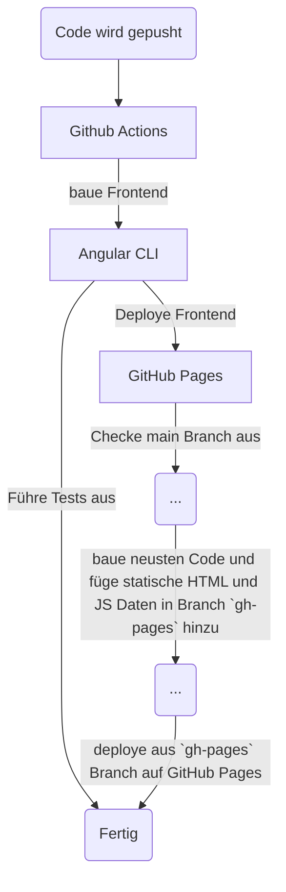

# KMS Taskliste Gruppe 2

## Teammitglieder:

- Julia Leimbach
- Winnie Carole Tongle Djoukeng
- Artem Grishin
- Paul David Hiller
- Vladislav Bova
- Jonas Schuck
- Samir Faycal Tahar M'Sallem

## Vorgehen:

Backend wurde in Spring Boot gebaut, Frontend in Angular

Da man auf GitHub Pages nur statische Websites ohne Backend deployen kann enthält der letzte Stand in `main` die Änderungen im Frontend, sodass es ohne Backend laufen kann, der Code für das Backend ist aber auch enthalten!

Backend funktioniert lokal, allerdings wurde es für GitHub Pages abgeschaltet!

## Features Implementiert:

- Auflisten von Aufgaben
- Erstellen von Aufgaben
- Löschen von Aufgaben
- Priorisieren von Aufgaben (Hoch, Normal, Niedrig)
- Aufgaben als erledigt/nicht erledigt markieren
- Aufgaben löschen

## YouTrack

https://youtrack.mni.thm.de/issues/KMS22G2

## Pipeline

Pipeline wurde mit Hilfe von GitHub Actions realisiert. Es wird einmal das Frontend gebaut und dann die Tests ausgeführt, weiterhin wird in einem zweiten Job das Frontend in GitHub Pages deployt.

## Deploy auf GitHub Pages

- Es existieren zwei GitHub Actions, einmal zum Ausführen der Tests im Frontend und ein Custom Deploy Job, da unser Frontend in einem Unterordner liegt.
- Es wird dazu das Frontend in dem Ordner gebaut und dann werden die gebauten Dateien in das Root-Verzeichnis in den docs Ordner verschoben.
- Da dies automatisch nach jedem Push geschieht und von uns nicht manuell gemacht werden muss, wird ein extra Branch automatisch erstellt, `gh-pages` der dann nach jedem Push mit den gebauten Dateien automatisch neu befüllt wird. Aus diesem Branch aus wird dann auch automatisch deployt!
- Mehr Informationen dazu in der Action Definition unter `.github/workflows/deploy.yml`
- Branch in den automatisch nach Push die neuen gebauten Dateien gepusht werden (alles automatisch durch CI/CD-Pipeline): https://github.com/samirmsallem/kms-tasklist/tree/gh-pages
- Deployte Pages Website: https://samirmsallem.github.io/kms-tasklist/

### Workflow beschrieben:

